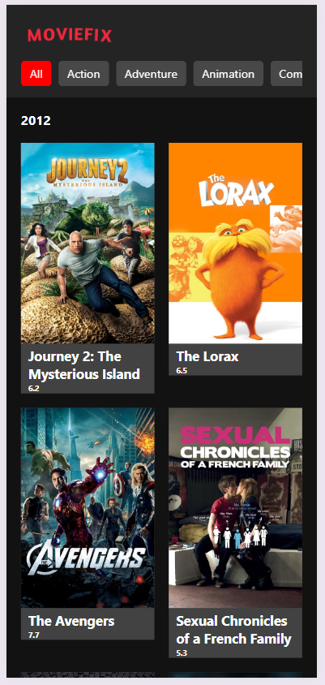

# FanCode MovieFlex

To Run this Project locally you need to follow few steps

Install required Packages using

### `npm install`

After installing packages you would be able to run application using

### `npm start`

This will start the app in development mode and ideally will be available at [http://localhost:3000](http://localhost:3000) to view it in the browser.

## Demo

#### Mobile View

## Description

We have avoided use of external libraries in this project and tried to handle all different scenarios mainly using native features

Few notable libraries which are used in this project are listed below

- `Redux is used for state-management`
- `Axios is used for calling api's`

This Application showcase use of React, JavaScript and TypeScript
